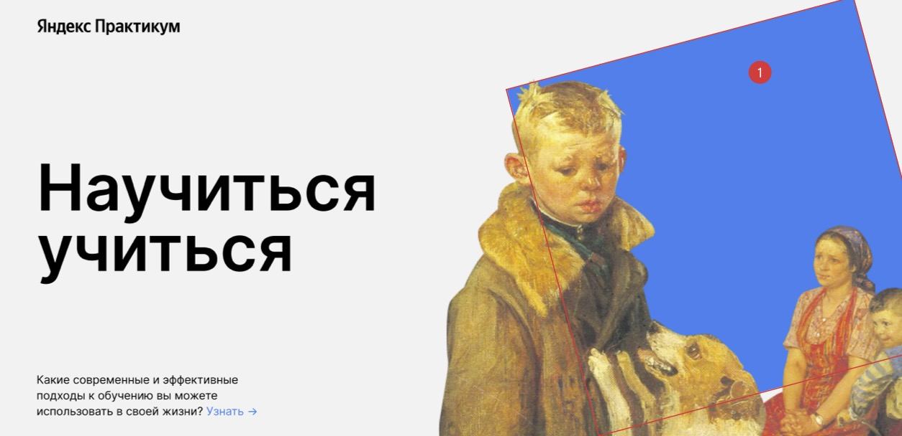

<h1 align="center">how-to-learn</h1>

---

Это проект, в котором были реализованы на практике базовые основы HTML и CSS. Проект был выполнен по БЭМ технологии с целью ознакомления с методологией. Дизайн-макет был использован для создание лендинг страницы по привлечению аудитории на курсы в Яндекс практикум. Из особенной функциональности использована анимация на базе CSS.
В планах доработки –– создание формы для обратной связи на сайте.

<h2>Работа выполнена с использованием технологий:</h2>
<ul>
  <li>
HTML
</li>
  <li>
CSS
</li>
  <li>
JavaScript
</li>
  <li>
Flexbox Layout
</li>
  <li>
Grid Layout
</li>
  <li>
Проект сделан по принципам объектно-ориентированного программирования
</li>
</ul>

________________________________

Ссылка на проект: https://ilkor4.github.io/how-to-learn/

<h2>Над проектом работал:</h2>
<h3><a href="https://github.com/ilkor4" target="_blank">Il.kor</a></h3>
